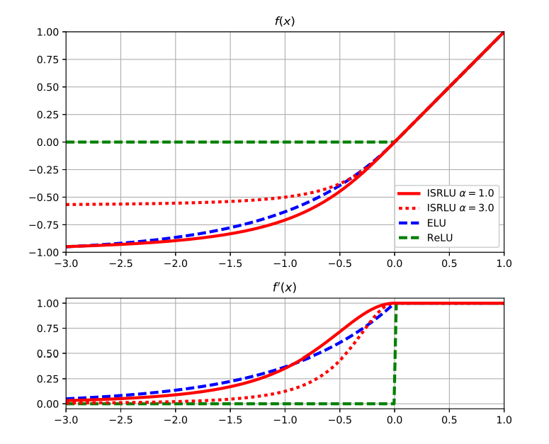

# Neural Net using ISRLU Activation Function in C++

## Background

Neural net implementation in C++ using ANSI ISO C++ Standards that can run on any standard compiler. The neural net uses an ISRLU as its activation function to take advantage of C++'s 'fast inverse square root algorithm'. I got inspiration for this project after randomly stumbling across [this](https://youtu.be/p8u_k2LIZyo) YouTube video and wondering whether implementing an 'inverse square root' activation function would speed up learning in deep neural networks. 

The Inverse Square Root Linear Unit (ISRLU) used was defined as the following:

$$f(x) = \begin{cases}
             x  & \text{if } x \ge 0 \\
             x(\frac{1}{\sqrt{1+\alpha{x^2}}})  & \text{if } x < 0
       \end{cases} \quad
f'(x) = \begin{cases}
             1  & \text{if } x \ge 0 \\
             (\frac{1}{\sqrt{1+\alpha{x^2}}})^3  & \text{if } x < 0
       \end{cases}$$

The ISRLU hyperparameter, $\alpha$, controls the value to which an ISRLU saturates for negative inputs. 

The main advantage of ISRLU over ELU is that it is based on the inverse square root, which has
been faster to evaluate than the exponential for many generations of systems.



A [paper](https://openreview.net/pdf?id=HkMCybx0-) was written about this specific topic and submitted to ICLR, however, it was rejected as 'the reviewers consider this to not be a significant innovation because the amount of time spent in computing the activation function is small compared to other neural network operations.'

## Running the neural net with a data set 

Use makeTraininSamples.cpp to change the neural network's topology or type of data. The default data set is an XOR dataset.

### Create training set
```bash
g++ makeTrainingSamples.cpp -o /bin/makeTrainingSamples
./makeTrainingSamples > XORtrainingData.txt
```
### Run the neural net using the training set 
```bash
g++ neuralNet.cpp -o neuralNet
./neuralNet > out.txt
```

## Resources
Paper: IMPROVING DEEP LEARNING BY INVERSE SQUARE
ROOT LINEAR UNITS (ISRLUS): https://openreview.net/pdf?id=HkMCybx0-

Review of Paper: https://openreview.net/forum?id=HkMCybx0-

Video: Fast Inverse Square Root — A Quake III Algorithm: https://www.youtube.com/watch?v=p8u_k2LIZyo 

Fast inverse square root: https://en.wikipedia.org/wiki/Fast_inverse_square_root

Activation functions: https://en.wikipedia.org/wiki/Activation_function
